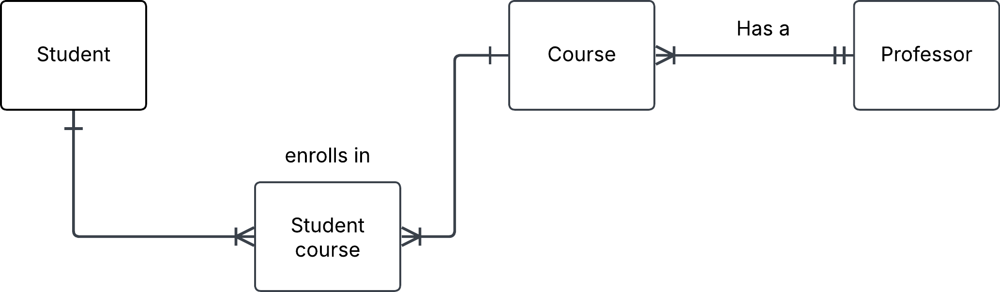
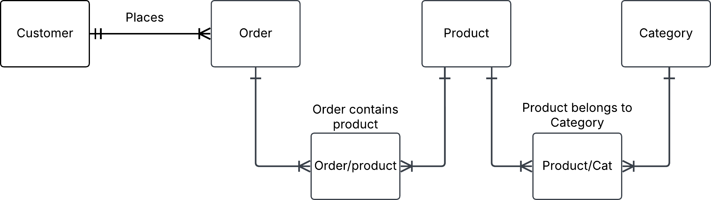

## 2. Library Bookly

A)
    Member and Book

B) 
    one to many

c)

## 3. Conceptual ERD to words

A)
    Customer kan hyra flera bilar
    Rent kan kopplas till en kund
    En bil kan kopplas till en hyra
    En eller flera hyror kan kopplas till flera bilar

B)
    Customer makes a rental
    Rental contains Car

c)
    One to many 
    Many to one

## 4. Online store

A)
    Entitys = Customer, Order, Product

B)

## 5. University management system

A)
    Student, Course, Professor

B)
    Student = Student_id, name
    Student_courses = student_id, Course_id
    Course = Course_id, name, professor_id
    Professor = professor_id, name

C)

D)
    If a course has zero students it's cancelled and does not start

## 6. Onshop

A)

B)
